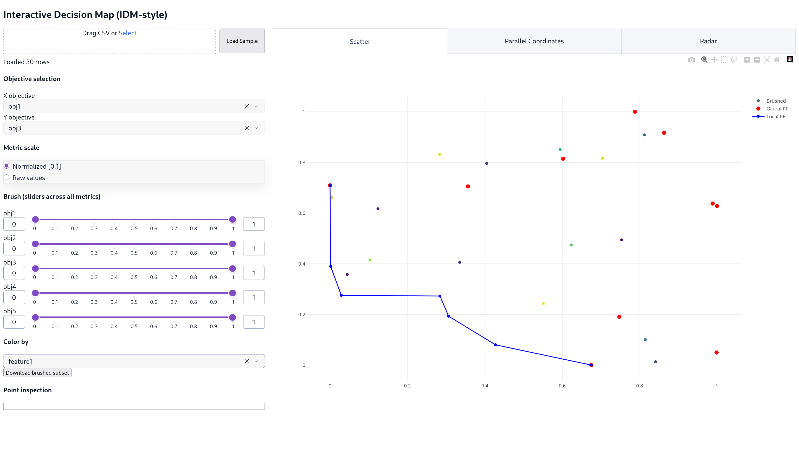
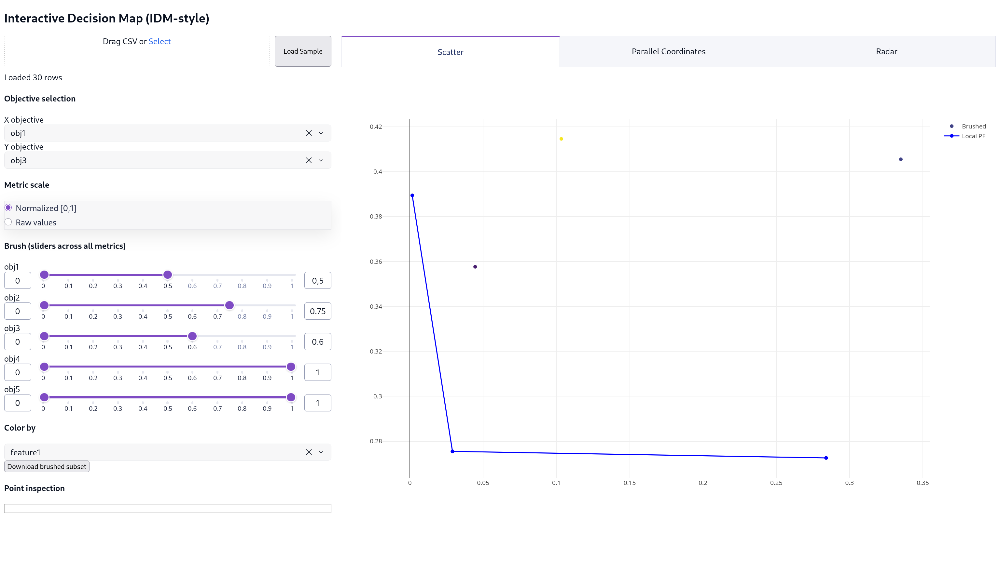
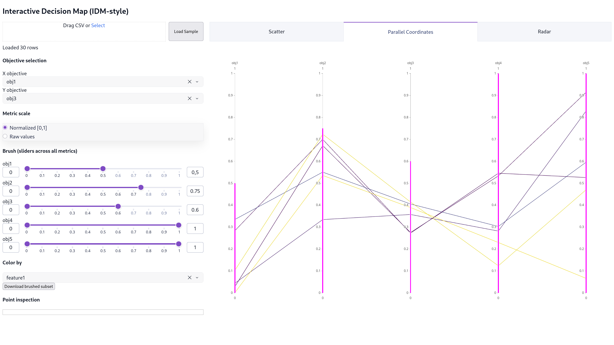
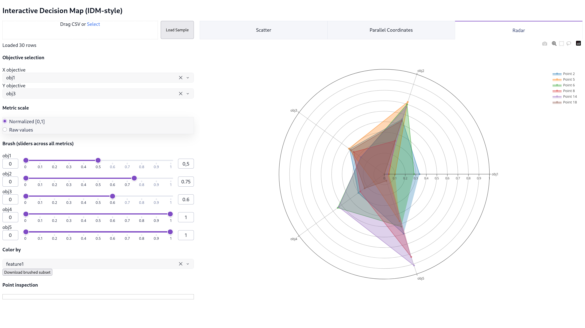
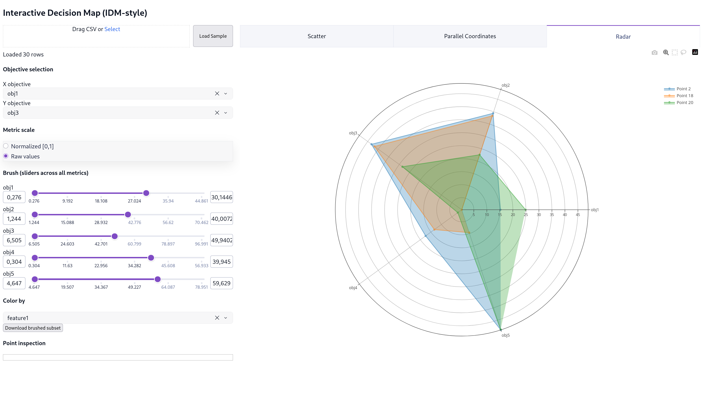

# Interactive Decision Map (IDM-style)

This viewer lets you explore multi-objective datasets with **slider-based brushing** across *all* metrics, interactive visualizations of metric relationships, and detailed inspection of individual solutions. Click a point to highlight it across all views.

## Features

- **Tabbed Visualization Layout**: Three complementary views to analyze trade-offs
  - **Scatter Plot**: 2D metric space with Pareto front highlighting
  - **Parallel Coordinates**: All metrics for brushed points with constraint ranges
  - **Radar Plot**: Multi-objective profiles as polar dimensions
- **Slider-based Brushing**: Filter solutions across all metrics with responsive updates
- **Scaled/Unscaled Metrics**: Toggle between normalized [0,1] and raw values
- **Sample Data Loader**: Quick-start with built-in test dataset
- **Point Inspection**: Click any point to see its parameters and metrics

## Gallery

### Scatter Plot - Initial View


### Scatter Plot - With Brushing


### Parallel Coordinates - Brushed Data


### Radar Plot - Normalized Metrics


### Radar Plot - Raw Values


## How to interpret each plot

### Scatter Plot
- X and Y axes: your selected `metric_*` columns (normalized to [0,1], lower is better).
- **Grey** points: all **brushed** points (i.e., those within the slider ranges across all metrics).
- **Red** points: brushed points that are also on the **global Pareto front** in the full metric space.
- **Blue line**: **local 2D Pareto front** within the brushed subset for the selected (X,Y) metrics.
- **Blue dot**: the **clicked/selected** point.

### Parallel Coordinates
- One vertical axis per `metric_*`; values are normalized to [0,1] (lower is better).
- **Grey lines**: all brushed points.
- **Red lines** (when no point is selected): lines that are globally Pareto-optimal.
- Axis shading (constraint range) reflects your **slider brush** per metric.

### Radar Plot
- One polar axis per `metric_*`; values normalized to [0,1] (or raw, see toggle).
- **Semi-transparent traces**: all brushed points, colored by the selected dimension.
- **Solid blue trace**: the currently **selected** point (highlighted for clarity).
- Useful for understanding multi-objective trade-offs and comparing metric profiles across solutions.

### Inspection Window (left)
- Shows **param_*** (parameters) and **metric_*** (metrics) for the selected point.
- Color dimension selector to highlight patterns in the data.

## Slider-based Brushing (Recommended)
Use the sliders (left column) to **constrain every metric's range**. The constraints are applied to *all* points before plotting, so all views show only the brushed subset. This gives you reliable, responsive filtering without external events.

## Metric Scales
Toggle between **Normalized [0,1]** (for comparing metrics on equal footing) and **Raw values** (to see original units). Sliders, axes, and all visualizations automatically adjust.

## Quick Start

Load sample data by clicking the **"Load Sample"** button next to the CSV upload box. No file needed—instant exploration!

Or upload your own CSV with columns formatted as:
- `param_*`: parameter/design variable columns
- `metric_*`: objective/performance metric columns

## Run
```bash
python idm_viewer/app.py
```
App runs at: http://0.0.0.0:8050
